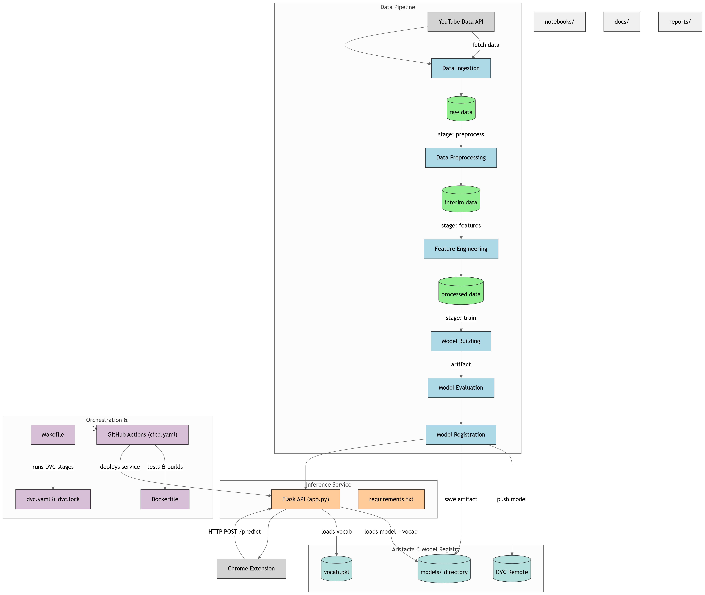

# 🎥 YouTube Comments Sentiment Analysis

This project uses machine learning to analyze the sentiment of comments on YouTube videos, providing detailed insights and live sentiment overlays via a custom Chrome Extension. Built with modularity and reproducibility in mind, it follows the Cookiecutter Data Science structure and incorporates a full MLOps workflow.

---

## 📌 Key Features

- ✅ Predicts comment sentiment (Positive / Neutral / Negative)
- 📊 Visual analytics to summarize sentiment trends
- 🌐 Chrome extension that overlays real-time comment sentiment on YouTube
- 🔁 MLOps pipeline with DVC, GitHub Actions, Docker, and Flask API
- 📦 Easy to install, extend, and deploy

---

## 🧠 Architecture Overview



### 🔄 Data Pipeline

- **YouTube Data API**: Collects raw comment data
- **Data Preprocessing & Feature Engineering**: Cleans and prepares the data for modeling
- **Model Training & Evaluation**: Sentiment model is trained, validated, and evaluated
- **Model Registration**: Artifacts are saved and tracked via DVC

### 🔌 Inference Service

- Flask API (`app.py`) serves model predictions
- Chrome Extension sends HTTP requests to the API
- Models and vocabulary (`vocab.pkl`) are versioned and stored in the DVC remote

---

## 📁 Project Structure

```bash
└── youtube-comments-analysis/
    ├── .github
    │   └── workflows
    ├── Dockerfile
    ├── LICENSE
    ├── Makefile
    ├── README.md
    ├── docs
    │   ├── Makefile
    │   ├── commands.rst
    │   ├── conf.py
    │   ├── getting-started.rst
    │   ├── index.rst
    │   └── make.bat
    ├── dvc.lock
    ├── dvc.yaml
    ├── experiment_info.json
    ├── flask_app
    │   ├── app.py
    │   ├── requirements.txt
    │   └── vocab.pkl
    ├── models
    │   └── .gitkeep
    ├── notebooks
    │   ├── .gitkeep
    │   ├── baseline_model.ipynb
    │   ├── baseline_model_bilstm.ipynb
    │   ├── baseline_model_using_lstm_torch.ipynb
    │   ├── bilstm_attention.ipynb
    │   ├── confusion_matrix.png
    │   ├── data_analysis.ipynb
    │   ├── data_ingestion.ipynb
    │   ├── data_preprocessing.ipynb
    │   └── pretrained_models.ipynb
    ├── params.yaml
    ├── references
    │   ├── .gitkeep
    │   └── dataset_resources.txt
    ├── reports
    │   ├── .gitignore
    │   ├── .gitkeep
    │   ├── confusion_matrix.png
    │   └── figures
    ├── requirements.txt
    ├── scripts
    │   └── test_model.py
    ├── setup.py
    ├── src
    │   ├── data
    │   ├── features
    │   ├── model
    │   └── visualization
    ├── test_environment.py
    └── tox.ini
```

## ⚙️ Installation & Usage

### Step 1: Clone the Repository

```bash
git clone https://github.com/Prayesh13/youtube-comments-analysis.git
cd youtube-comments-analysis
```

### Step 2: Set Up Environment

```bash
python -m venv venv
source venv/bin/activate  # Windows: venv\Scripts\activate
pip install -r requirements.txt
```
### Step 3: Run Pipeline

```bash
dvc repro  # run pipeline in powershell
```

---

## 🚀 Deploy Inference API

To launch the Flask API for prediction:

```bash
python .\flask_app\app.py
```

The API will be available at `http://localhost:5000/predict`

### Example POST request

```json
POST /predict
{
  "comment": "This video is amazing!"
}
```

---

## 🧩 Chrome Extension Integration

This project includes a Chrome extension that overlays sentiment analysis directly onto the YouTube interface.

🔗 **Chrome Plugin GitHub Repo**: [https://github.com/Prayesh13/Yt-chrome-plugin-frontend](https://github.com/Prayesh13/Yt-chrome-plugin-frontend)

### Clone the Repository

```bash
git clone https://github.com/Prayesh13/Yt-chrome-plugin-frontend.git
cd Yt-chrome-plugin-frontend
```

### 📷 Extension Preview

| Comment Sentiment UI
[Comment Sentiment UI](https://drive.google.com/file/d/1iN9bWdj-lKZvjtg4EUiFmpSf0FxlYTxC/view?usp=sharing)
---

## 🧪 Testing & CI/CD

* **Unit Testing**: Configure tests inside `tests/` and run with `pytest`
* **CI/CD**: GitHub Actions config in `.github/workflows/ci-cd.yaml`
* **Dockerized**: Use `Dockerfile` for containerized deployment

---

## 📄 License

Distributed under the MIT License. See [`LICENSE`](LICENSE) for details.

---

> 💡 Built with ❤️ using the [Cookiecutter Data Science Template](https://drivendata.github.io/cookiecutter-data-science/)

```
